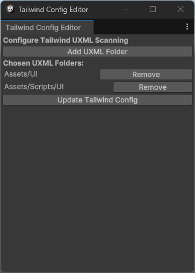

# Tailwind Unity

Tailwind CSS for Unity allows developers to integrate the powerful Tailwind CSS framework with Unity's UI Toolkit. This tool enables Unity users to leverage Tailwind's utility-first CSS to style UXML components effortlessly. By converting Tailwind's rem and arbitrary value classes to Unity-supported formats and simplifying class structures, this tool facilitates seamless UI styling for games and apps. This tool automatically monitors changes in UXML and C# files, triggering CSS regeneration when needed, and can be added globally to reduce the need for manual updates, significantly enhancing workflow efficiency.

This project is currently a work in progress and is likely to change. Expect updates, improvements, and possible breaking changes as development continues!

## Requirements:
* Unity Version: 6000.0 or later
* Node.js: Installed for using Tailwind's build process (npx).

## Installation
Add the Git Repository to Unity: Add the package to Unity’s Package Manager by modifying the Packages/manifest.json:

```json
{
  "dependencies": {
    "com.ngc-corp.unity-tailwindcss": "https://github.com/ngc-corp/unity-tailwindcss"
  }
}
```

## Initialize

Navigate to `Tools/Tailwind/Init Tailwind`.

This will create a Tailwind folder in your Assets directory with the necessary files. However, since no paths are being monitored yet, the tailwind.uss file will remain empty.

## Configure monitored paths

Navigate to `Tools/Tailwind/Configure Tailwind`.



Here, you can set paths to be monitored for changes in `.uxml` and `.cs` files. If any file in these directories changes, tailwind.uss will be rebuilt.

## Add tailwind.uss toyour theme

For the final step to use Tailwind classes in Unity, you need to add the `tailwind.uss` stylesheet to your runtime theme, as shown in the screenshot. By default, your theme is located at `UI Toolkit/UnityThemes/UnityDefaultRuntimeTheme`.


## Support My Work

If you've found my projects helpful and want to support future developments, consider buying me a coffee! Your support helps me continue creating awesome open-source tools and content. 😊

[](https://ko-fi.com/B0B014JJ1U)
