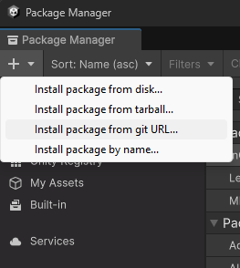
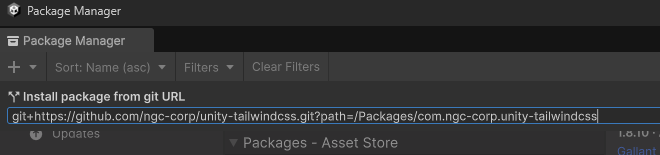
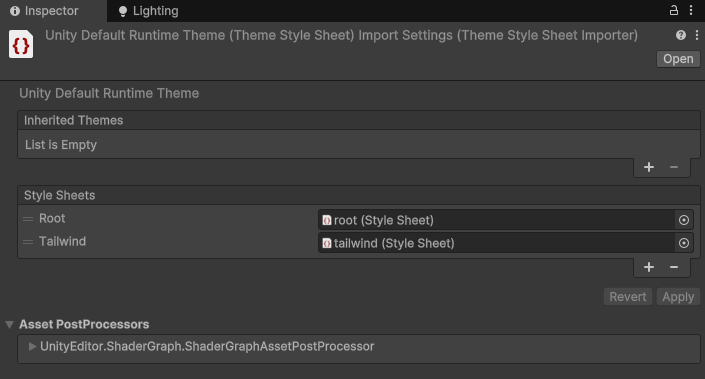
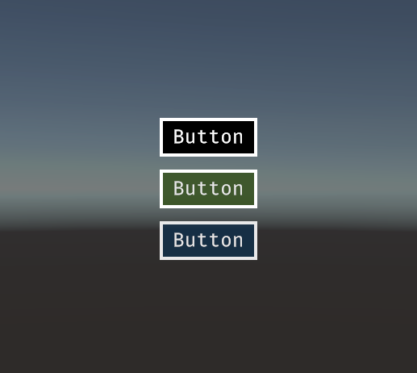

# Unity - Tailwind CSS

Tailwind CSS for Unity allows developers to integrate the powerful Tailwind CSS framework with Unity's UI Toolkit. This tool enables Unity users to leverage Tailwind's utility-first CSS to style UXML components effortlessly. By converting Tailwind's rem and arbitrary value classes to Unity-supported formats and simplifying class structures, this tool facilitates seamless UI styling for games and apps. This tool automatically monitors changes in UXML, C# and CSS files, triggering CSS regeneration when needed, and can be added globally to reduce the need for manual updates, significantly enhancing workflow efficiency.

Unity's USS (Unity Style Sheets) is more restrictive with selectors compared to standard CSS used by Tailwind. While this integration brings many benefits of Tailwind into Unity, there are key differences, such as the lack of support for certain selectors and the need to adapt class naming conventions (e.g., avoiding / in class names). We highly recommend checking the example code provided to understand how Tailwind classes are applied in Unity and to explore the differences between traditional Tailwind and this Unity-adapted version.

This project is currently a work in progress and is likely to change. Expect updates, improvements, and possible breaking changes as development continues!

## Support My Work

If you've found my projects helpful and want to support future developments, consider buying me a coffee! Your support helps me continue creating awesome open-source tools and content. 😊

[](https://ko-fi.com/B0B014JJ1U)

## Requirements:

* Unity Version: 6000.0 or later
* Node.js: Installed for using Tailwind's build process (20.18.0 recommended).

## Installation

### Option 1

Go to the Releases section on GitHub and download the Unity package. Then, with your project open, simply run the file to install it.

### Option 2

Navigate to `Window/Package Manager`.

On the top left side choose `+ -> Install package from git URL`.



Enter `git+https://github.com/ngc-corp/unity-tailwindcss.git?path=/Packages/com.ngc-corp.unity-tailwindcss` and confirm.



### Option 3

Add the package to Unity's Package Manager by modifying the `Packages/manifest.json`:

```json
{
  "dependencies": {
    "com.ngc-corp.unity-tailwindcss": "git+https://github.com/ngc-corp/unity-tailwindcss.git?path=/Packages/com.ngc-corp.unity-tailwindcss"
  }
}
```

## Initialize

Navigate to `Tools/Tailwind/Init Tailwind`.

This will create a TailwindCSS folder in your Assets directory with the necessary files. However, since no paths are being monitored yet, the tailwind.uss file will remain empty.

## Configure monitored paths

Navigate to `Tools/Tailwind/Configure Tailwind`.


Here, you can set paths to be monitored for changes in `.uxml`, `.cs` and `.css` files. If any file in these directories changes, tailwind.uss will be rebuilt.

If you plan to create custom styles in `styles.css` located in `Assets/TailwindCSS`, make sure to add this folder to the monitored paths as well.

## Add tailwind.uss to your theme

For the final step to use Tailwind classes in Unity, you need to add the `tailwind.uss` stylesheet to your runtime theme, as shown in the screenshot. By default, your theme is located at `UI Toolkit/UnityThemes/UnityDefaultRuntimeTheme`.


If you don't want to use Unity's default styles, you can remove the default theme. To get this working, you need to define some root styles. Create a `root.uss` file with the following properties and add it to your theme:

```css
:root {
  -unity-font-definition: resource("Assets/UI/Fonts/<your-font>.ttf");
  font-size: 16px;
  color: #000;
}
```



## Example

Let's assume you have an `Overlay.uxml` file and a script called `UIOverlay.cs` that adds buttons for the main menu.

```xml
<UXML xmlns="UnityEngine.UIElements" class="grow">
  <VisualElement name="overlay" class="grow justify-center items-center bg-black-opacity-80">
</UXML>
```

```csharp
using System;
using System.Collections.Generic;
using UnityEngine;
using UnityEngine.UIElements;

public class UIOverlay : MonoBehaviour {
  public void Show(Dictionary<string, Action> actions) {
    UIDocument uIDocument = GetComponent<UIDocument>();
    VisualElement visualElement = uIDocument.rootVisualElement.Q<VisualElement>("overlay");

    foreach (KeyValuePair<string, Action> pair in actions) {
      Button button = new();

      // button.AddToClassList("flex"); // flex is the default in USS
      button.AddToClassList("justify-center");
      button.AddToClassList("items-center");
      button.AddToClassList("h-12");
      button.AddToClassList("border-4");
      button.AddToClassList("border-white");
      button.AddToClassList("bg-black");
      button.AddToClassList("px-3");
      button.AddToClassList("py-2");
      button.AddToClassList("text-2xl");
      button.AddToClassList("text-white");

      // USS-compatibility

      // Text alignment is implemented through a custom plugin because Unity uses a unique format for text alignment (-unity-text-align)
      button.AddToClassList("text-middle-center");

      // Unity doesn't support ":" as the default separator, so we use "_" instead.
      // For example, use `hover_bg-white` instead of `hover:bg-white`.
      button.AddToClassList("hover_bg-white");
      button.AddToClassList("hover_text-black");

      button.text = pair.Key;
      button.RegisterCallback<ClickEvent>(ev => pair.Value());

      visualElement.Add(button);
    }
  }
}
```

If these files are within the configured monitored folders, the USS file will be generated in `Assets/TailwindCSS/tailwind.uss`.

Which results in the following UI.


## Example 2 (opacity)

Unity does not support "/" in class names, so we've implemented a USS-compatible logic to ensure opacity can be set for color, background-color, and border-color.

```xml
<UXML xmlns="UnityEngine.UIElements" class="grow">
  <VisualElement name="overlay" class="grow justify-center items-center bg-black-opacity-80">
    <Button name="button" text="Button" class="flex justify-center items-center h-12 border-4 border-white px-3 py-2 bg-black text-2xl text-white text-middle-center hover_bg-white hover_text-black active_opacity-50 active_bg-black active_text-white" />
    <Button name="button" text="Button" class="flex justify-center items-center h-12 border-4 border-white mt-4 bg-lime-900-opacity-90 px-3 py-2 text-2xl text-white-opacity-80 text-middle-center hover_bg-white hover_text-black active_opacity-50 active_bg-black active_text-white" />
    <Button name="button" text="Button" class="flex justify-center items-center h-12 border-4 border-white-opacity-80 mt-4 bg-sky-950-opacity-80 px-3 py-2 text-2xl text-white-opacity-80 text-middle-center hover_bg-white hover_text-black active_opacity-50 active_bg-black active_text-white" />
  </VisualElement>
</UXML>
```

* `active_opacity-50` instead of `active:opacity-50`
* `bg-lime-900-opacity-90` instead of `bg-lime-900/90`
* `text-white-opacity-80` instead of `text-white/80`
* `border-white-opacity-70` instead of `border-white/70`



## Flexbox Grid

```xml
<UXML xmlns="UnityEngine.UIElements">
  <VisualElement class="container" name="flexbox-grid">
    <VisualElement class="row">
      <VisualElement class="col">
        <!-- CONTENT -->
      </VisualElement>
      <VisualElement class="col">
        <!-- CONTENT -->
      </VisualElement>
      <VisualElement class="col">
        <!-- CONTENT -->
      </VisualElement>
    </VisualElement>
  </VisualElement>
</UXML>
```

## Core Plugins

USS supports these core plugins out of the box. However, there are some limitations with certain plugins. For example, `border-e-green-800` won't work, but `border-green-800` will. Currently, there are some converters and plugins for unsupported core plugins already. If you need a specific core plugin for your project, feel free to open an issue, and I'll do my best to make it compatible.

Properties that differ from the default Tailwind behavior are explained in the example column.

| Property                 | Supported  | Example |
|--------------------------|------------|---------|
| accentColor              | ❌         |
| accessibility            | ❌         |
| alignContent             | ✅         |
| alignItems               | ✅         |
| alignSelf                | ✅         |
| animation                | ❌         |
| appearance               | ❌         |
| aspectRatio              | ❌         |
| backdropBlur             | ❌         |
| backdropBrightness       | ❌         |
| backdropContrast         | ❌         |
| backdropFilter           | ❌         |
| backdropGrayscale        | ❌         |
| backdropHueRotate        | ❌         |
| backdropInvert           | ❌         |
| backdropOpacity          | ❌         |
| backdropSaturate         | ❌         |
| backdropSepia            | ❌         |
| backgroundAttachment     | ❌         |
| backgroundBlendMode      | ❌         |
| backgroundClip           | ❌         |
| backgroundColor          | ✅         |
| backgroundImage          | ✅         | `none` |
| backgroundOpacity        | ✅         | `bg-lime-900-opacity-90` |
| backgroundOrigin         | ❌         |
| backgroundPosition       | ✅         |
| backgroundRepeat         | ✅         |
| backgroundSize           | ✅         |
| blur                     | ❌         |
| borderCollapse           | ❌         |
| borderColor              | ✅         |
| borderOpacity            | ✅         | `border-white-opacity-70` |
| borderRadius             | ✅         |
| borderSpacing            | ❌         |
| borderStyle              | ❌         |
| borderWidth              | ✅         |
| boxDecorationBreak       | ❌         |
| boxShadow                | ❌         |
| boxShadowColor           | ✅         |
| boxSizing                | ❌         |
| breakAfter               | ❌         |
| breakBefore              | ❌         |
| breakInside              | ❌         |
| brightness               | ❌         |
| captionSide              | ❌         |
| caretColor               | ❌         |
| clear                    | ❌         |
| columns                  | ❌         |
| contain                  | ❌         |
| container                | ✅         |
| content                  | ❌         |
| contrast                 | ❌         |
| cursor                   | ✅         |
| display                  | ✅         | `flex`, `hidden` |
| divideColor              | ❌         |
| divideOpacity            | ❌         |
| divideStyle              | ❌         |
| divideWidth              | ❌         |
| dropShadow               | ❌         |
| fill                     | ❌         |
| filter                   | ❌         |
| flex                     | ✅         |
| flexBasis                | ✅         |
| flexDirection            | ✅         |
| flexGrow                 | ✅         |
| flexShrink               | ✅         |
| flexWrap                 | ✅         |
| float                    | ❌         |
| fontFamily               | ❌         |
| fontSize                 | ✅         |
| fontSmoothing            | ❌         |
| fontStyle                | ❌         |
| fontVariantNumeric       | ❌         |
| fontWeight               | ❌         |
| forcedColorAdjust        | ❌         |
| gap                      | ❌         |
| gradientColorStops       | ❌         |
| grayscale                | ❌         |
| gridAutoColumns          | ❌         |
| gridAutoFlow             | ❌         |
| gridAutoRows             | ❌         |
| gridColumn               | ❌         |
| gridColumnEnd            | ❌         |
| gridColumnStart          | ❌         |
| gridRow                  | ❌         |
| gridRowEnd               | ❌         |
| gridRowStart             | ❌         |
| gridTemplateColumns      | ❌         |
| gridTemplateRows         | ❌         |
| height                   | ✅         |
| hueRotate                | ❌         |
| hyphens                  | ❌         |
| inset                    | ❌         |
| invert                   | ❌         |
| isolation                | ❌         |
| justifyContent           | ✅         |
| justifyItems             | ✅         |
| justifySelf              | ✅         |
| letterSpacing            | ✅         |
| lineClamp                | ❌         |
| lineHeight               | ❌         |
| listStyleImage           | ❌         |
| listStylePosition        | ❌         |
| listStyleType            | ❌         |
| margin                   | ✅         |
| maxHeight                | ✅         |
| maxWidth                 | ✅         |
| minHeight                | ✅         |
| minWidth                 | ✅         |
| mixBlendMode             | ❌         |
| objectFit                | ❌         |
| objectPosition           | ❌         |
| opacity                  | ✅         |
| order                    | ❌         |
| outlineColor             | ❌         |
| outlineOffset            | ❌         |
| outlineStyle             | ❌         |
| outlineWidth             | ❌         |
| overflow                 | ✅         |
| overscrollBehavior       | ❌         |
| padding                  | ✅         |
| placeContent             | ❌         |
| placeItems               | ❌         |
| placeSelf                | ❌         |
| placeholderColor         | ❌         |
| placeholderOpacity       | ❌         |
| pointerEvents            | ❌         |
| position                 | ✅         | `absolute`, `relative` |
| preflight                | ❌         |
| resize                   | ❌         |
| ringColor                | ❌         |
| ringOffsetColor          | ❌         |
| ringOffsetWidth          | ❌         |
| ringOpacity              | ❌         |
| ringWidth                | ❌         |
| rotate                   | ❌         |
| saturate                 | ❌         |
| scale                    | ❌         |
| scrollBehavior           | ❌         |
| scrollMargin             | ❌         |
| scrollPadding            | ❌         |
| scrollSnapAlign          | ❌         |
| scrollSnapStop           | ❌         |
| scrollSnapType           | ❌         |
| sepia                    | ❌         |
| size                     | ✅         |
| skew                     | ❌         |
| space                    | ❌         |
| stroke                   | ❌         |
| strokeWidth              | ❌         |
| tableLayout              | ❌         |
| textAlign                | ✅         | `text-upper-left`, `text-middle-left`, `text-lower-left`, `text-upper-center`, `text-middle-center`, `text-lower-center`, `text-upper-right`, `text-middle-right`, `text-lower-right` |
| textColor                | ✅         |
| textDecoration           | ❌         |
| textDecorationColor      | ❌         |
| textDecorationStyle      | ❌         |
| textDecorationThickness  | ❌         |
| textIndent               | ❌         |
| textOpacity              | ✅         | `text-white-opacity-80` |
| textOverflow             | ✅         |
| textTransform            | ❌         |
| textUnderlineOffset      | ❌         |
| textWrap                 | ❌         |
| touchAction              | ❌         |
| transform                | ❌         |
| transformOrigin          | ✅         |
| transitionDelay          | ✅         |
| transitionDuration       | ✅         |
| transitionProperty       | ✅         |
| transitionTimingFunction | ✅         | `ease-linear`, `ease-in`, `ease-out`, `ease-in-out`, `ease-in-sine`, `ease-out-sine`, `ease-in-out-sine`, `ease-in-cubic`, `ease-out-cubic`, `ease-in-out-cubic`, `ease-in-back`, `ease-out-back`, `ease-in-out-back`, `ease-in-bounce`, `ease-out-bounce`, `ease-in-out-bounce` |
| translate                | ❌         |
| userSelect               | ❌         |
| verticalAlign            | ❌         |
| visibility               | ✅         |
| whitespace               | ✅         |
| width                    | ✅         |
| willChange               | ❌         |
| wordBreak                | ❌         |
| zIndex                   | ❌         |

## Custom Plugins

| Property                 | Supported  | Example |
|--------------------------|------------|---------|
| --unity-selection-color  | ✅         | `u-selection-white`, `u-selection-white-opacity-30` |
| --unity-cursor-color     | ✅         | `u-cursor-white`, `u-cursor-white-opacity-30` |
| --unity-image-size       | ✅         | `stretch-to-fill`, `scale-and-crop`, `scale-to-fit` |
| -unity-background-tint-color | ✅     | `u-bg-tint-white`, `u-bg-tint-white-opacity-30` |
