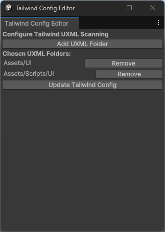
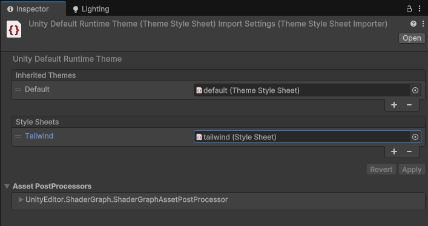

# Unity - Tailwind CSS

Tailwind CSS for Unity allows developers to integrate the powerful Tailwind CSS framework with Unity's UI Toolkit. This tool enables Unity users to leverage Tailwind's utility-first CSS to style UXML components effortlessly. By converting Tailwind's rem and arbitrary value classes to Unity-supported formats and simplifying class structures, this tool facilitates seamless UI styling for games and apps. This tool automatically monitors changes in UXML and C# files, triggering CSS regeneration when needed, and can be added globally to reduce the need for manual updates, significantly enhancing workflow efficiency.

This project is currently a work in progress and is likely to change. Expect updates, improvements, and possible breaking changes as development continues!

## Support My Work

If you've found my projects helpful and want to support future developments, consider buying me a coffee! Your support helps me continue creating awesome open-source tools and content. 😊

[](https://ko-fi.com/B0B014JJ1U)

## Requirements:

* Unity Version: 6000.0 or later
* Node.js: Installed for using Tailwind's build process (npx).

## Installation

Add the Git Repository to Unity: Add the package to Unity’s Package Manager by modifying the Packages/manifest.json:

```json
{
  "dependencies": {
    "com.ngc-corp.unity-tailwindcss": "git+https://github.com/ngc-corp/unity-tailwindcss.git"
  }
}
```

## Initialize

Navigate to `Tools/Tailwind/Init Tailwind`.

This will create a TailwindCSS folder in your Assets directory with the necessary files. However, since no paths are being monitored yet, the tailwind.uss file will remain empty.

## Configure monitored paths

Navigate to `Tools/Tailwind/Configure Tailwind`.



Here, you can set paths to be monitored for changes in `.uxml` and `.cs` files. If any file in these directories changes, tailwind.uss will be rebuilt.

## Add tailwind.uss to your theme

For the final step to use Tailwind classes in Unity, you need to add the `tailwind.uss` stylesheet to your runtime theme, as shown in the screenshot. By default, your theme is located at `UI Toolkit/UnityThemes/UnityDefaultRuntimeTheme`.



## Core Plugins

USS supports these core plugins out of the box. However, there are some limitations with certain plugins. For example, `border-e-green-800` won't work, but `border-green-800` will. Currently, there are no converters for unsupported core plugins, but this is subject to change as the library evolves during its use in an active project. If you need a specific core plugin for your project, feel free to open an issue, and I'll do my best to make it compatible.

| Property                 | Supported |
|--------------------------|-----------|
| accentColor              | ❌         |
| accessibility            | ❌         |
| alignContent             | ✅         |
| alignItems               | ✅         |
| alignSelf                | ✅         |
| animation                | ❌         |
| appearance               | ❌         |
| aspectRatio              | ❌         |
| backdropBlur             | ❌         |
| backdropBrightness       | ❌         |
| backdropContrast         | ❌         |
| backdropFilter           | ❌         |
| backdropGrayscale        | ❌         |
| backdropHueRotate        | ❌         |
| backdropInvert           | ❌         |
| backdropOpacity          | ❌         |
| backdropSaturate         | ❌         |
| backdropSepia            | ❌         |
| backgroundAttachment     | ❌         |
| backgroundBlendMode      | ❌         |
| backgroundClip           | ❌         |
| backgroundColor          | ✅         |
| backgroundImage          | ❌         |
| backgroundOpacity        | ❌         |
| backgroundOrigin         | ❌         |
| backgroundPosition       | ✅         |
| backgroundRepeat         | ✅         |
| backgroundSize           | ✅         |
| blur                     | ❌         |
| borderCollapse           | ❌         |
| borderColor              | ✅         |
| borderOpacity            | ❌         |
| borderRadius             | ✅         |
| borderSpacing            | ❌         |
| borderStyle              | ❌         |
| borderWidth              | ✅         |
| boxDecorationBreak       | ❌         |
| boxShadow                | ❌         |
| boxShadowColor           | ✅         |
| boxSizing                | ❌         |
| breakAfter               | ❌         |
| breakBefore              | ❌         |
| breakInside              | ❌         |
| brightness               | ❌         |
| captionSide              | ❌         |
| caretColor               | ❌         |
| clear                    | ❌         |
| columns                  | ❌         |
| contain                  | ❌         |
| container                | ✅         |
| content                  | ❌         |
| contrast                 | ❌         |
| cursor                   | ✅         |
| display                  | ✅         |
| divideColor              | ❌         |
| divideOpacity            | ❌         |
| divideStyle              | ❌         |
| divideWidth              | ❌         |
| dropShadow               | ❌         |
| fill                     | ❌         |
| filter                   | ❌         |
| flex                     | ✅         |
| flexBasis                | ✅         |
| flexDirection            | ✅         |
| flexGrow                 | ✅         |
| flexShrink               | ✅         |
| flexWrap                 | ✅         |
| float                    | ❌         |
| fontFamily               | ❌         |
| fontSize                 | ✅         |
| fontSmoothing            | ❌         |
| fontStyle                | ❌         |
| fontVariantNumeric       | ❌         |
| fontWeight               | ❌         |
| forcedColorAdjust        | ❌         |
| gap                      | ❌         |
| gradientColorStops       | ❌         |
| grayscale                | ❌         |
| gridAutoColumns          | ❌         |
| gridAutoFlow             | ❌         |
| gridAutoRows             | ❌         |
| gridColumn               | ❌         |
| gridColumnEnd            | ❌         |
| gridColumnStart          | ❌         |
| gridRow                  | ❌         |
| gridRowEnd               | ❌         |
| gridRowStart             | ❌         |
| gridTemplateColumns      | ❌         |
| gridTemplateRows         | ❌         |
| height                   | ✅         |
| hueRotate                | ❌         |
| hyphens                  | ❌         |
| inset                    | ❌         |
| invert                   | ❌         |
| isolation                | ❌         |
| justifyContent           | ✅         |
| justifyItems             | ✅         |
| justifySelf              | ✅         |
| letterSpacing            | ✅         |
| lineClamp                | ❌         |
| lineHeight               | ❌         |
| listStyleImage           | ❌         |
| listStylePosition        | ❌         |
| listStyleType            | ❌         |
| margin                   | ✅         |
| maxHeight                | ✅         |
| maxWidth                 | ✅         |
| minHeight                | ✅         |
| minWidth                 | ✅         |
| mixBlendMode             | ❌         |
| objectFit                | ❌         |
| objectPosition           | ❌         |
| opacity                  | ✅         |
| order                    | ❌         |
| outlineColor             | ❌         |
| outlineOffset            | ❌         |
| outlineStyle             | ❌         |
| outlineWidth             | ❌         |
| overflow                 | ✅         |
| overscrollBehavior       | ❌         |
| padding                  | ✅         |
| placeContent             | ❌         |
| placeItems               | ❌         |
| placeSelf                | ❌         |
| placeholderColor         | ❌         |
| placeholderOpacity       | ❌         |
| pointerEvents            | ❌         |
| position                 | ✅         |
| preflight                | ❌         |
| resize                   | ❌         |
| ringColor                | ❌         |
| ringOffsetColor          | ❌         |
| ringOffsetWidth          | ❌         |
| ringOpacity              | ❌         |
| ringWidth                | ❌         |
| rotate                   | ❌         |
| saturate                 | ❌         |
| scale                    | ❌         |
| scrollBehavior           | ❌         |
| scrollMargin             | ❌         |
| scrollPadding            | ❌         |
| scrollSnapAlign          | ❌         |
| scrollSnapStop           | ❌         |
| scrollSnapType           | ❌         |
| sepia                    | ❌         |
| size                     | ✅         |
| skew                     | ❌         |
| space                    | ❌         |
| stroke                   | ❌         |
| strokeWidth              | ❌         |
| tableLayout              | ❌         |
| textAlign                | ✅         |
| textColor                | ✅         |
| textDecoration           | ❌         |
| textDecorationColor      | ❌         |
| textDecorationStyle      | ❌         |
| textDecorationThickness  | ❌         |
| textIndent               | ❌         |
| textOpacity              | ❌         |
| textOverflow             | ✅         |
| textTransform            | ❌         |
| textUnderlineOffset      | ❌         |
| textWrap                 | ❌         |
| touchAction              | ❌         |
| transform                | ❌         |
| transformOrigin          | ✅         |
| transitionDelay          | ✅         |
| transitionDuration       | ✅         |
| transitionProperty       | ✅         |
| transitionTimingFunction | ✅         |
| translate                | ❌         |
| userSelect               | ❌         |
| verticalAlign            | ❌         |
| visibility               | ✅         |
| whitespace               | ✅         |
| width                    | ✅         |
| willChange               | ❌         |
| wordBreak                | ❌         |
| zIndex                   | ❌         |
